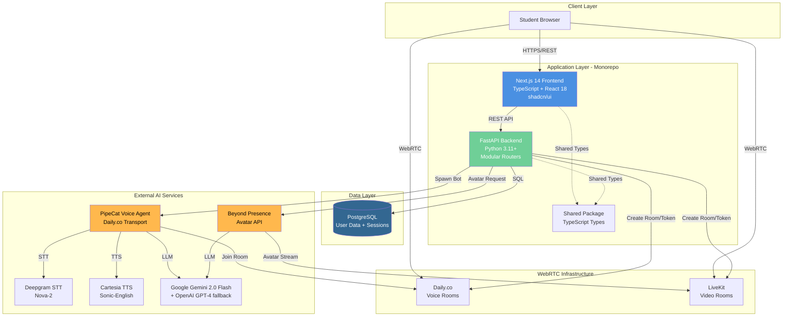

# College Student Counseling Platform Architecture Document

**Version:** 1.0  
**Date:** December 19, 2025  
**Status:** In Progress

---

## Introduction

This document outlines the overall project architecture for the **College Student Counseling Platform**, including backend systems, shared services, and non-UI specific concerns. Its primary goal is to serve as the guiding architectural blueprint for AI-driven development, ensuring consistency and adherence to chosen patterns and technologies.

**Relationship to Frontend Architecture:**
If the project includes a significant user interface, a separate Frontend Architecture Document will detail the frontend-specific design and MUST be used in conjunction with this document. Core technology stack choices documented herein (see "Tech Stack") are definitive for the entire project, including any frontend components.

### Starter Template or Existing Project

**Analysis:** This is a **greenfield project** with explicit technology selections defined in the PRD. The project is not based on a specific starter template, though it references the PipeCat integration guide repository (https://github.com/mksinha01/agent-starter-embed) for voice calling implementation patterns.

**Technology Foundation:**
- Frontend: Next.js 14 (App Router) with React 18
- Backend: FastAPI with Python 3.11+
- Monorepo: pnpm workspaces or Turborepo
- UI: shadcn/ui with Tailwind CSS

The PipeCat reference repository provides integration guidance for voice AI functionality but does not serve as the project foundation. This approach gives maximum architectural flexibility while maintaining clear technology boundaries defined in the PRD.

### Change Log

| Date | Version | Description | Author |
|------|---------|-------------|--------|
| 2025-12-19 | 1.0 | Initial architecture document | Winston (Architect) |

---

## High Level Architecture

### Technical Summary

The College Student Counseling Platform employs a **hybrid monolithic architecture** with modular service boundaries, deployed as a monorepo containing distinct frontend and backend applications. The system leverages **FastAPI** (Python) for the backend API and **Next.js 14** (TypeScript) for the frontend, communicating via RESTful APIs and real-time WebRTC connections. Key external integrations include **PipeCat** for voice AI counseling, **Beyond Presence** for avatar video, **Daily.co/LiveKit** for WebRTC infrastructure, **Deepgram** for speech-to-text, **Cartesia** for text-to-speech, and **Google Gemini 2.0 Flash/OpenAI GPT-4** for LLM capabilities. This architecture prioritizes **rapid MVP development** while maintaining modularity for future microservice extraction, supporting the PRD goal of delivering instant-access counseling with 99.5% uptime and <30 second connection times.

### High Level Overview

**1. Architectural Style**

**Hybrid Monolith with Modular Services** - A single FastAPI application organized into modular routers (authentication, sessions, counselor management) that can be extracted into microservices if scale demands. The frontend is a separate Next.js application, creating a clear separation between presentation and business logic layers.

**2. Repository Structure**

**Monorepo** using pnpm workspaces or Turborepo, containing:
- `packages/frontend` - Next.js 14 application
- `packages/backend` - FastAPI Python application
- `packages/shared` - Shared TypeScript types and utilities
- Root-level configuration for monorepo tooling

This structure enables atomic commits across full-stack features, simplified dependency management, and consistent TypeScript types shared between frontend and backend.

**3. Service Architecture**

- **Frontend Service:** Next.js 14 App Router serving the UI, handling client-side state, and managing WebRTC connections
- **Backend Service:** FastAPI monolith providing REST APIs for authentication, session management, counselor configuration, and orchestration of external AI services
- **External Managed Services:** PipeCat voice agents, Beyond Presence avatar API, Daily.co/LiveKit WebRTC infrastructure treated as black-box dependencies
- **Data Layer:** Single PostgreSQL instance for user accounts, session logs, and counselor configurations

**4. Primary User Interaction Flow**

```
Student Login → Authentication (JWT) → Dashboard (Counselor Selection) 
    ↓
Voice Call: Backend creates Daily.co room → Spawns PipeCat bot → Student joins via WebRTC → Real-time transcription
    ↓
Video Call: Backend creates LiveKit room → Triggers Beyond Presence avatar → Student joins via WebRTC → Avatar lip-sync
    ↓
Session History → View transcripts → Download/Delete sessions
```

**5. Key Architectural Decisions**

- **Monolith over Microservices:** Simplifies MVP development, reduces operational complexity, and avoids premature optimization. Backend remains cohesive while maintaining internal modularity through FastAPI routers.

- **Monorepo over Polyrepo:** Enables shared TypeScript types between frontend/backend, atomic feature commits, and simplified dependency updates. Aligns with PRD's rapid iteration goals.

- **Managed WebRTC Services (Daily.co/LiveKit):** Offloads complex real-time infrastructure (TURN/STUN servers, bandwidth optimization, recording) to proven platforms, allowing team to focus on counseling experience rather than WebRTC plumbing.

- **JWT in httpOnly Cookies:** Balances security (XSS protection) with stateless authentication, enabling horizontal scaling of backend without session store dependency.

- **PostgreSQL over NoSQL:** Session transcripts and user data have clear relational structure. ACID guarantees ensure consistency for authentication and session logging. Future sharding possible if scale requires.

### High Level Project Diagram



### Architectural and Design Patterns

**Backend Core Patterns:**

- **Repository Pattern:** Abstract data access logic behind repository interfaces (`UserRepository`, `SessionRepository`). Enables testing with mock repositories and future database migration flexibility.  
  _Rationale:_ Decouples business logic from SQLAlchemy specifics, critical for unit testing and maintaining clean architecture boundaries.

- **Dependency Injection:** FastAPI's native DI system for injecting database sessions, repositories, and services into route handlers.  
  _Rationale:_ Improves testability (inject mocks), reduces coupling, and aligns with FastAPI best practices.

- **Router/Controller Pattern:** Organize endpoints into logical routers (`auth_router`, `session_router`, `counselor_router`) within modular backend structure.  
  _Rationale:_ Enables clear separation of concerns and future extraction to microservices if needed without major refactoring.

**Integration Patterns:**

- **Adapter Pattern:** Wrap external APIs (Daily.co, PipeCat, Beyond Presence) in adapter classes with consistent interfaces.  
  _Rationale:_ Isolates external API changes, simplifies testing with mock adapters, and enables provider switching if needed.

- **Circuit Breaker Pattern:** Protect against cascading failures from external service outages (Daily.co, Deepgram, etc.) using circuit breaker library (e.g., `pybreaker`).  
  _Rationale:_ PRD requires 99.5% uptime and graceful degradation; circuit breakers prevent thread exhaustion from hanging external calls.

**Communication Patterns:**

- **REST API:** Synchronous HTTP/JSON for authentication, session creation, history retrieval. Standard CRUD operations with OpenAPI documentation.  
  _Rationale:_ Simple, well-understood, and sufficient for non-real-time operations. Aligns with PRD's explicit REST API requirement.

- **WebRTC Signaling:** Backend orchestrates WebRTC room creation and token generation; actual media streams bypass backend entirely (peer-to-peer via Daily.co/LiveKit TURN servers).  
  _Rationale:_ Reduces backend bandwidth costs, offloads WebRTC complexity to managed services, enables 50+ concurrent sessions per PRD.

**Data Patterns:**

- **Active Record (via SQLAlchemy ORM):** Database models contain both data and persistence logic, standard for Python/FastAPI projects.  
  _Rationale:_ Balances simplicity with functionality; Repository pattern abstracts this at service layer.

- **Event Logging Pattern:** All counseling sessions logged as immutable records with metadata (student_id, category, duration, transcript). No event sourcing complexity in MVP.  
  _Rationale:_ Supports PRD requirements for session history, analytics, and FERPA compliance auditing.

---

## Tech Stack

**CRITICAL:** This section is the DEFINITIVE technology selection for the entire project. All agents (dev, frontend architect, QA) MUST reference these exact versions. Any deviation requires updating this document.

### Cloud Infrastructure

- **Provider:** Railway (for MVP), with migration path to AWS/GCP if scale demands
- **Key Services:** 
  - PostgreSQL (Railway-managed)
  - Docker container hosting
  - Environment variable management
  - Automatic HTTPS/SSL
- **Deployment Regions:** US-based (single region for MVP)

**Rationale:** Railway offers the fastest path to production with minimal DevOps overhead, automatic deployments from GitHub, and managed PostgreSQL. The containerized architecture ensures portability to AWS/GCP when needed. PRD emphasizes MVP speed over enterprise infrastructure.

### Technology Stack Table

| Category | Technology | Version | Purpose | Rationale |
|----------|-----------|---------|---------|-----------|
| **Languages** |
| Backend Language | Python | 3.11.7 | Primary backend development language | Async/await support, strong typing via Pydantic, excellent AI/ML library ecosystem, team preference per PRD |
| Frontend Language | TypeScript | 5.3.3 | Primary frontend development language | Strict mode enabled, type safety across frontend/backend boundary, PRD requirement |
| **Runtimes** |
| JavaScript Runtime | Node.js | 20.11.0 LTS | Frontend build and development runtime | Long-term support, stable for Next.js 14 |
| **Frontend** |
| Web Framework | Next.js | 14.2.0 | React-based web framework | App Router for modern routing, server components, API routes, PRD requirement |
| UI Library | React | 18.3.0 | Component-based UI library | Latest stable, concurrent features, included with Next.js |
| UI Components | shadcn/ui | Latest | Accessible component library | Built on Radix UI primitives, highly customizable, PRD requirement |
| Styling | Tailwind CSS | 3.4.1 | Utility-first CSS framework | Rapid styling, design system consistency, PRD requirement |
| State Management | React Context + Zustand | 18.3.0 + 4.5.0 | Global state management | Context for auth state, Zustand if complexity grows, PRD guidance |
| Form Handling | React Hook Form | 7.51.0 | Form validation and state | Minimal re-renders, integrates with Zod validation |
| Schema Validation | Zod | 3.22.4 | Runtime type validation | Shared schemas with backend, type-safe API contracts |
| **Backend** |
| Web Framework | FastAPI | 0.110.0 | Python async web framework | High performance, auto OpenAPI docs, Pydantic validation, PRD requirement |
| Validation | Pydantic | 2.6.0 | Data validation and settings | Type-safe request/response models, included with FastAPI |
| Database ORM | SQLAlchemy | 2.0.27 | Async ORM for PostgreSQL | Async support, mature ecosystem, PRD requirement |
| Database Migrations | Alembic | 1.13.1 | Database schema migrations | Standard with SQLAlchemy, version-controlled schemas |
| Authentication | python-jose | 3.3.0 | JWT token generation/validation | HS256 signing, httpOnly cookie storage per PRD |
| Password Hashing | bcrypt | 4.1.2 | Secure password hashing | Industry standard, OWASP recommended |
| **Database** |
| Primary Database | PostgreSQL | 16.1 | Relational database | ACID guarantees, JSON support, mature replication, PRD requirement |
| Connection Pooling | asyncpg | 0.29.0 | Async PostgreSQL driver | High performance, used by SQLAlchemy async |
| **Real-Time Communication** |
| Voice WebRTC | Daily.co SDK | Latest | Voice call infrastructure | Managed TURN/STUN, recording, PRD requirement |
| Video WebRTC | LiveKit Client | 0.11.0 | Video call infrastructure | Low latency, scalable, PRD requirement |
| PipeCat Framework | @pipecat-ai/client-js + Python SDK | Latest | Voice AI agent framework | Daily.co integration, STT/TTS/LLM orchestration, PRD requirement |
| **AI Services** |
| Primary LLM | Google Gemini 2.0 Flash | API Latest | Counseling conversation generation | Fast, cost-effective, PRD requirement |
| Fallback LLM | OpenAI GPT-4 | gpt-4-turbo-preview | LLM fallback if Gemini unavailable | Reliability, PRD requirement |
| Speech-to-Text | Deepgram Nova-2 | API Latest | Voice transcription | Real-time streaming, high accuracy, PRD requirement |
| Text-to-Speech | Cartesia Sonic-English | API Latest | Natural voice synthesis | Low latency, expressive, PRD requirement |
| Avatar Service | Beyond Presence API | API Latest | AI avatar video generation | Lip-sync, emotional expressions, PRD requirement |
| **Development Tools** |
| Package Manager | pnpm | 8.15.0 | Monorepo package management | Fast, disk-efficient, workspace support |
| Monorepo Tool | Turborepo | 1.12.0 | Build orchestration | Caching, parallelization, PRD mentions this or pnpm workspaces |
| Linting (Frontend) | ESLint | 8.56.0 | JavaScript/TypeScript linting | Standard for Next.js projects |
| Formatting | Prettier | 3.2.4 | Code formatting | Consistent style across team |
| Linting (Backend) | Ruff | 0.1.15 | Fast Python linting/formatting | Replaces Black+Flake8, significantly faster |
| Type Checking (Backend) | mypy | 1.8.0 | Static type checking for Python | Enforce type safety |
| Testing (Frontend) | Vitest | 1.2.0 | Unit testing framework | Fast, Vite-native, modern alternative to Jest |
| Testing (Backend) | pytest | 8.0.0 | Python testing framework | Async support, fixtures, standard in Python |
| E2E Testing | Playwright | 1.41.0 | Browser automation testing | Cross-browser, reliable, PRD mentions limited E2E for MVP |
| **Deployment & DevOps** |
| Containerization | Docker | 25.0.0 | Application containerization | Consistent environments, PRD requirement |
| Container Orchestration | Docker Compose | 2.24.0 | Local multi-container orchestration | Development environment |
| CI/CD Platform | GitHub Actions | Latest | Automated testing and deployment | Free for public repos, PRD requirement |
| Deployment Platform | Railway | Latest | Cloud hosting (MVP) | Simple deployment, managed Postgres, auto-scaling |
| **Observability** |
| Logging (Backend) | Loguru | 0.7.2 | Structured logging | Simple API, structured output, PRD requirement |
| Logging (Frontend) | Custom Logger | N/A | Browser console abstraction | Structured logs, environment-aware |
| Error Tracking | Sentry | Latest SDK | Error monitoring and alerting | Captures exceptions, performance monitoring, PRD mentions |
| **Security & Secrets** |
| Secrets Management (Dev) | .env files | N/A | Local environment variables | Standard for development, PRD requirement |
| Secrets Management (Prod) | Railway Environment Variables | N/A | Production secrets | Encrypted, per-environment isolation |
| CORS Handling | fastapi-cors-middleware | Built-in | Cross-origin request handling | Included with FastAPI |

---

## Data Models

